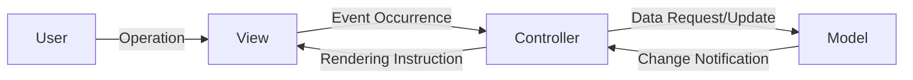
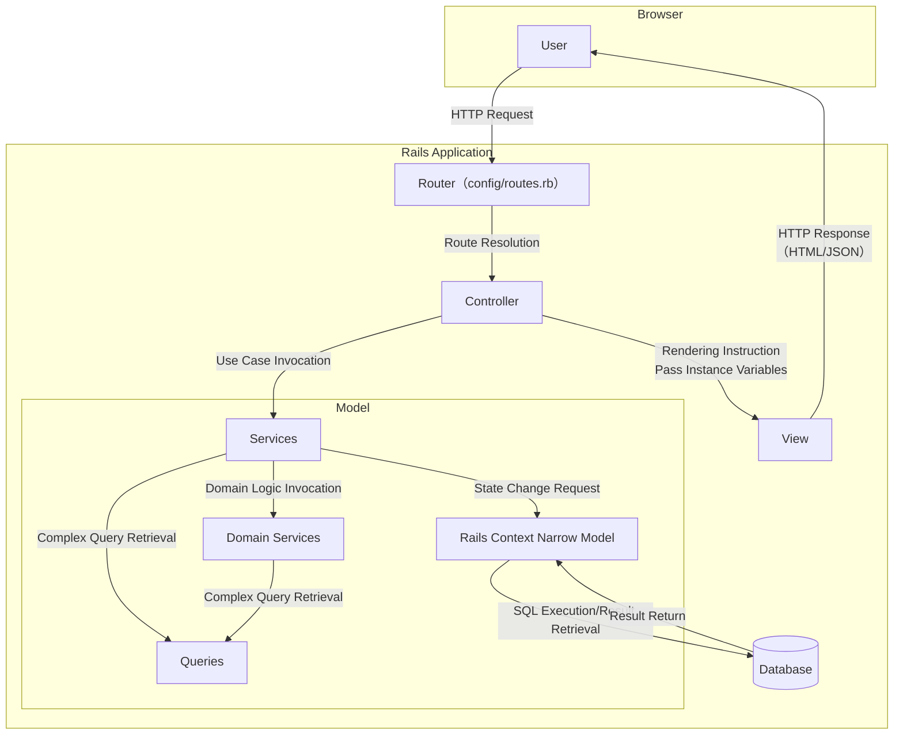
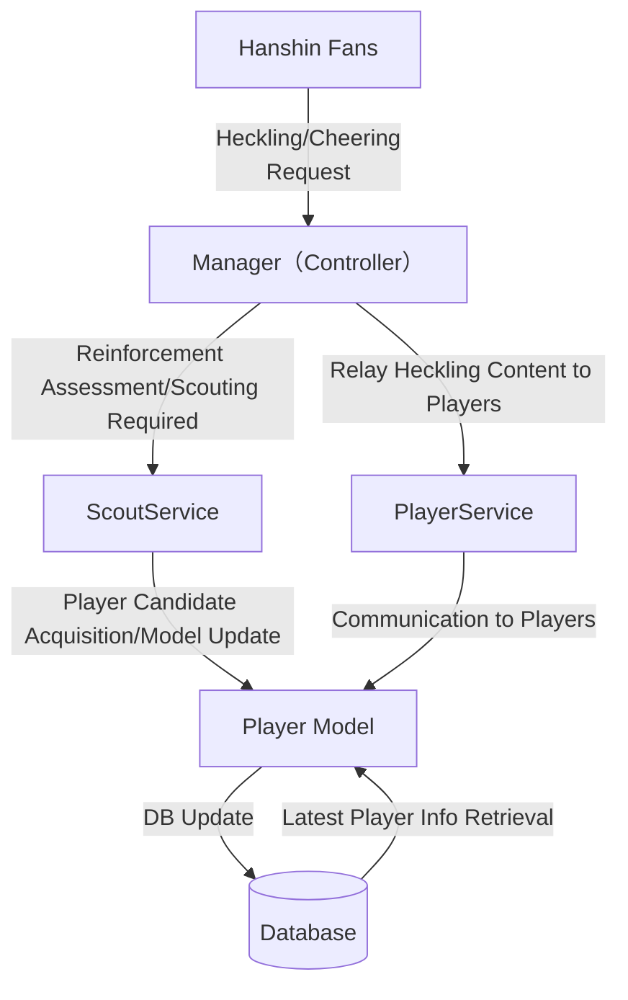
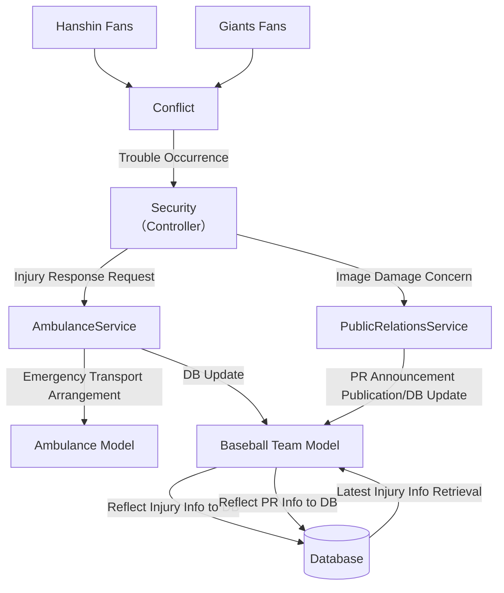

First, I will explain the overview of the MVC (Model-View-Controller) pattern as a general abstract concept in software architecture, then discuss the characteristics of MVC architecture in Rails, and promote understanding of MVC by contrasting both approaches.

Finally, I would like to apply MVC architecture to the Hanshin Tigers.

## What is the MVC (Model-View-Controller) Pattern as an Abstract Concept

### The Three Roles (Responsibilities) of MVC

- **Model**
    - The part that handles the "data" and "business logic" of the application.
    - Not only handles persistence responsibilities such as data retrieval, storage, and updates, but also implements domain rules (e.g., product price calculation, inventory management) and validation logic (e.g., input validation).
    - The part that handles the perspective of "what to deal with (domain)."
- **View**
    - The "appearance (UI) part" displayed to users.
    - This includes HTML and template engines, GUI components for desktop applications, or JSON formatting when returning REST APIs.
    - Responsible for data presentation (layout and formatting) and user input forms - purely "presentation" responsibilities.
- **Controller**
    - The role of receiving user input (e.g., HTTP requests in web applications), calling appropriate Models for processing, and passing the results to Views.
    - The part that controls the "flow."
        - Example: When a user presses the "user registration" button → Controller receives the request, asks Model (User) to register user information → Model saves to DB → Controller receives the save result and renders the View to return, etc.
    - Also handles screen transitions, routing distribution, parameter reception/preprocessing, and exception handling.

### What Makes MVC Great

The biggest benefit is the ability to clarify application responsibilities. By clarifying responsibilities, component independence is guaranteed, leading to improved ease of division of labor, reusability, and maintainability through clear test targets.

## MVC Architecture in Rails

MVC itself is merely a "way of thinking about role division," and how to implement it specifically (class structure, directory structure, whether to use ORM, template engine selection, etc.) varies by framework and project.

For example, Ruby/Rails MVC, Java/Spring MVC, PHP/Laravel MVC, Python/Django MTV (strictly speaking, close to MVC), etc. - even with the same MVC philosophy, implementations vary widely. Here, I'll touch on the specifics of MVC Architecture in the Rails context.

Rails (Ruby on Rails) emphasizes "Convention over Configuration" as a design philosophy, and the MVC structure also runs on established rails of "if you do this, it works this way." Below, I'll explain Rails-specific mechanisms and "Rails-style" MVC.

### Model (Rails Case)

- **ActiveRecord**
    - Rails Model layer is basically implemented by inheriting from ActiveRecord classes.
    - Handles database mapping (ORM: Object-Relational Mapping), with table name to class name mapping and column to attribute mapping performed automatically.
    - For example, just writing `class User < ApplicationRecord` links to the `users` table, and `User.find(1)` can retrieve record number 1.
- **Declarative Description of Validation and Associations**
    - Standard practice is to write validations declaratively in Model classes like `validates :email, presence: true, uniqueness: true`.
    - Associations with other tables are also declared like `has_many :posts` / `belongs_to :user`.
    - These declarations make DB schema integration and related model connections easy.
- **Where to Place Business Logic**
    - Rails recommends "Fat Model, Skinny Controller."
    - However, when it becomes too complex, it's common to split logic using Service objects, Domain Service objects, and Concerns. Rather than explicitly placing a Repository layer from the start, it's more common to handle this with ActiveRecord Scopes, query methods, and module division.

### View (Rails Case)

- **ERB (Embedded Ruby) Templates**
    - By default, Ruby code is embedded in `.html.erb` files to output HTML.
    - Directory structure like `app/views/controller_name/action_name.html.erb` automatically corresponds to routing, and when rendering from Controller, the corresponding View is rendered.
- **Other Template Engines Also Available**
    - Haml, Slim, Builder (for XML generation), and even incorporating React or Vue to partially write JSX/TSX are possible, but "Rails standard View = ERB" is the strong perception.
    - Also, when using API mode to return JSON, `.jbuilder` templates or `render json:` can be used to build the View part with Ruby code.
- **Layouts and Partials**
    - Define layouts applied to the entire application like `app/views/layouts/application.html.erb`, and use `yield` to insert each action's template.
    - The mechanism to call partial templates (_header.html.erb, etc.) like `render 'header'` comes standard, providing high View reusability.

### Controller (Rails Case)

- **Inheriting from ActionController::Base**
    - Create Controllers corresponding to each resource (e.g., User) like `app/controllers/users_controller.rb`, and define action methods (e.g., index, show, new, create, edit, update, destroy).
    - Writing `resources :users` in routing (config/routes.rb) automatically generates RESTful URL to Controller action mappings.
- **Filters (before_action, after_action, etc.)**
    - Authentication checks and common preprocessing can be set declaratively like `before_action :authenticate_user!`.
    - This makes it easier to focus on "business logic and model calls" within each action.
- **Strong Parameters**
    - Parameter permission/restriction is defined on the controller side like `params.require(:user).permit(:name, :email)`.
    - This incorporates a mechanism to prevent mass assignment of unauthorized attributes.
- **How to Return Responses**
    - Writing `render :show` or `redirect_to users_path` in actions automatically renders corresponding views or redirects to different URLs.
    - When returning JSON format, just writing `render json: @user` automatically performs serialization through ActiveModel::Serializers or Jbuilder.

### Conceptual Diagram Summary

## Rearchitecting the Hanshin Tigers

I will apply the MVC concepts summarized so far to the Hanshin Tigers.

### View Positioning

First, let's define the View positioning. What users (Hanshin Tigers fans) see are "stadium scenes," "player performances," and "cheering scenes." This corresponds to the "View" in MVC.

### Controller and Model: Use Case 1

As a premise, heckling comes from Hanshin fans toward the View. While I won't deliberately touch on specific heckling content here, there are various types: simple cheering, encouraging words that inspire players, or malicious heckling that reduces player motivation. If this affects player performance and influences win/loss outcomes, the Hanshin Tigers application could be considered somewhat vulnerable. Therefore, let's prepare a Controller to handle heckling requests.

While there's room for discussion about what this Controller should be, let's consider the manager as the Controller for now.

All heckling requests to the View first transition to the manager Controller. Here, malicious requests are validated to prevent packets from flowing to players.

For constructive, encouraging heckling, the manager Controller calls PlayerService, formats request data as needed, and coordinates with players.

Furthermore, if the manager Controller judges that "players aren't functioning at all," it calls ScoutService to gather data for judging whether to "cut players at the end of this season" or "reinforce with alternative players." Player DB updates are also performed continuously in ScoutService.

### **Controller and Model: Use Case 2**

Also, Hanshin Tigers fans become more heated during Giants games, creating a tense atmosphere where Hanshin and Giants fans are on the verge of conflict. It's important to prepare for potential brawl trouble requests.

Since this differs from heckling requests, let's prepare a separate Controller as a security Controller.

This security Controller checks the scale of fights and presence of injuries, validating and assessing urgency to determine what level of response is needed.

For example, for "light argument level," only local security guards stopping it would be sufficient. In other words, if the request is simple, only Controller processing is needed without Model coordination. If it becomes "full-scale violence with injuries," AmbulanceService is called to handle injured parties.

Also, if this spreads the image that "going to the stadium is scary," it could lead to decreased attendance and sales, so PublicRelationsService is called as needed to improve the team's image.

While not mentioned in Use Case 1, AmbulanceService could also be called from the manager Controller when a player gets hit by a dead ball. This also allows us to enjoy the reusability benefits of MVC architecture.

## Summary

I summarized abstract MVC concepts and Rails Architecture MVC using diagrams to understand each respectively.

MVC as a software architecture is merely a major concept of role division, and specific implementations differ by framework and project. In the case of Rails MVC, I feel anew that it's convenient to have clear conventions and tool sets prepared from the start.